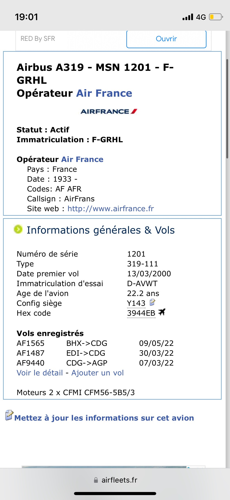

# Nom d'une Nouvelle Recrue

On dispose seulement d'un nom : "Edrabellah Chateaubrion"

Je le recherche sur la plupart des plateformes de réseaux sociaux.

je trouve un profil patfait pour [LinkedIn](https://www.linkedin.com/in/edrabellah-chateaubrion-b2572423a/)

je cherche les informations que je peux utiliser.

on trouve :

- [ce post](https://www.linkedin.com/posts/edrabellah-chateaubrion-b2572423a_cv-activity-6930686792270524416-16NW?utm_source=linkedin_share&utm_medium=member_desktop_web) qui nous donne une addresse mail : **edrabellah.chateaubrion59@laposte.net**
- un [**site web** : http://vendeur-de-qualite-chateaubrion.duckdns.org](http://vendeur-de-qualite-chateaubrion.duckdns.org)
- Un grand attachement à Google.

On découvre sur son site qu'il est marié à Madame **Hälbeardt**

En cherchant sur Google on trouve un commentaire sur le Zoo de lille.

Ceci nous donne un compte Google : [Edrabellah Hälbeardt](https://www.google.com/maps/contrib/103519939941085426873/photos/@32.5212054,-28.9168924,4z/data=!3m1!4b1!4m3!8m2!3m1!1e1?hl=fr)

en cherchant dasn ses posts, on trouve une référenceà une rencontre à partir d'un aéroport:

Au total on possède les informations suivantes :

- Aéroport Charles de Gaule
- Début du mois de mars 2022
- Pas de pluie
- Destination au soleil
- Terminal 2E porte K
- Air France F-GRHL

En croisant les recherches et avec beaucoup d'échecs, on fini par trouver :

Et donc un seul vol possible :

malaga le 07/03/2022

donc le flag est :

>404CTF{malaga_07_03_2022}
