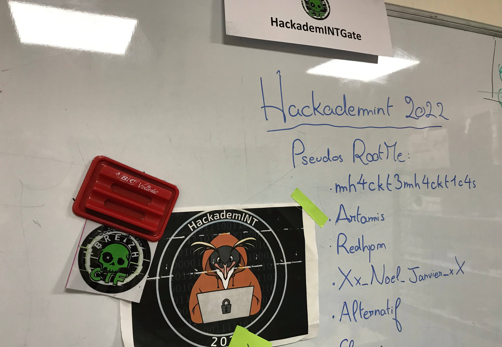

# Nous Sommes Infiltres


On dispose d'une liste de noms :

- mh4ckt3mh4ckt1c4s
- Artamis
- Redhpm
- Xx_Noel_Janvier_xX
- Alternatif

On note également la présence de RootMe.

on cherche sur [RootMe](https://www.root-me.org/fr/) les différents pseudos et on trouve : le profile de [**Xx_Noel_Janvier_xX**](https://www.root-me.org/Xx_Noel_Janvier_xX?lang=fr)

Cette page fait référence à un site internet : [**Gorfouland**](https://e10pthes.github.io/about/)

En se connectant sur le site, on se rend compte qu'il n'y a qu'un seul vrai lien : le formulaire de Citoyenneté (tous les autres renvoie sur la page d'accueil).

Sur le site, est disponible une page [twitter](https://twitter.com/e10pthes):

en fouillant les tweets, on trouve un échange avec un certain [**Pablo Sintera**](https://twitter.com/PabloSintera)

Cet échange fait référence à une vielle paeg internet obtenue dans une ancienne version du site.

On remarque que la page est hébergée sur Github. On peut donc regarder le code source.

On cherche sur Github le mot clé [Gorfouland](https://github.com/search?q=gourfouland&type=code)

Cela donne un bout de code qui appartient à un repo Githud qui correspond au site **Gorfouland**.

Dans les commits on trouve :

```text
Correction mineure d'un bug de redirection
```

Quand on fouille dans le code on peut trouver une [ancienne page](http://hallebarde.duckdns.org)

Quand on ouvre cette page, on obtient :

>404CTF{Att3nt10n_AU8_V13ux_C0mMiT5}
