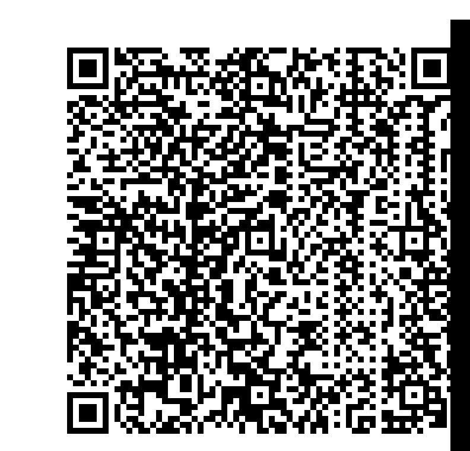

# Découpé

On ouvre le fichier [Zip fourni](decoupe.zip) et le décompresse.

on remarque que les fichiers semblent suivre une sorte de logique et sont dans le bon ordre.

On reconstitue l'image grâce à [solution.py](solution.py)

on obtient l'image suivante :

il s'agit d'un QR code.

lorqu'on le scanne, on obtient :

>404CTF{M4n1PuL4T10N_d'1M4g3S_F4c1L3_n0N?}
